# **Breastfeeding Support iOS Application**

# **User Manual**
Version 1.0 - November 30, 2017

#### **Project**
CDC Breastfeeding Support Initiative

#### **Team We Didn't Start the FHIR**
Jamon Bowen, Phillip Baxley, Justin Kristensen, John Van Wagenen, Zeyu Yang

#### **GitHub Link**
https://github.gatech.edu/gt-hit-fall2017/CDC-BREASTFEEDING-SUPPORT-INITIATIVE.git

---

### 1. Introduction

#### &nbsp;

#### 1.1 Purpose
The purpose of this document is to provide instructions on how to run the features associated with the Care Provider's Web Portal and the Breastfeeding Support iOS application.

#### &nbsp;

#### 1.2 Application Purpose
The purpose of the Care Provider Web Portal is to provide a way for Care Providers to monitor patient's breastfeeding data, suggest if a mother needs to be referred to a lactation consultant, and to send referral information to lactation consultants.

The purpose of the iOS application is to provide a way for mothers to record breastfeeding data, answer questionnaires, and submit hospital data, recorded data, and concerns to their care provider’s web portal.

---
### 2. Care Provider Web Portal
This section provides instructions on how to use the features associated with the Care Provider's Web Portal.

#### 2.1 Server Startup

The web portal is currently delivered along with the Docker Container containing the test FHIR server. To start the server that serves the Physician Portal content, simply start the docker container.

#### 2.2 Accessing the Portal

The web portal can be accessed by going to the docker container's public url `/portal`. By default, this url should be `http://localhost:8080/portal/`.

#### 2.3 Navigating the Portal

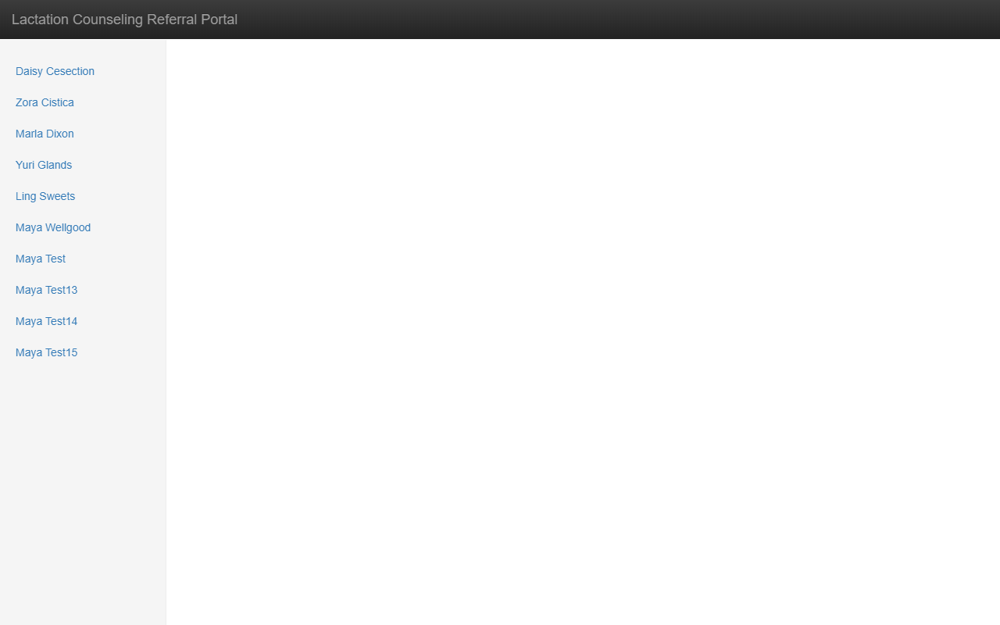

Upon navigating to the Physician Portal, the user should see a mostly blank web page. On the left there is a list of patients that are in the system. This list only includes the names of the mothers. Clicking on a mother's name will bring up detailed information about the mother and some basic information about the baby and how breastfeeding is going.

##### 2.3.1 Mother's detailed information

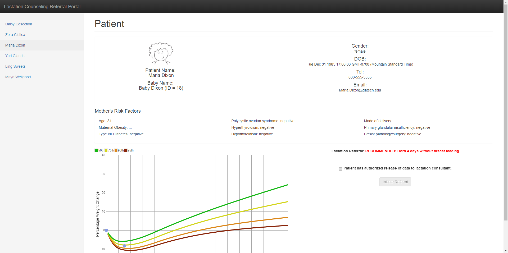

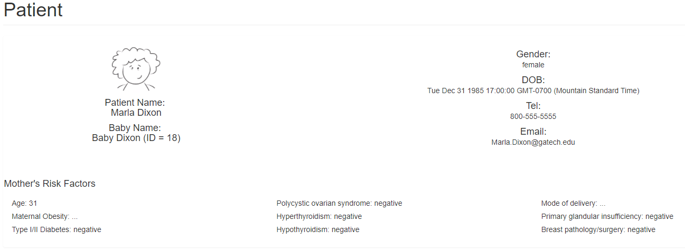

After clicking on a mother's name, the user should see the following information:

- Name
- Date of Birth
- Phone Number
- Email Address

Below the general information area, there is a section that contains the mother's risk factors for the physician to review. These risk factors are as follows:

- Age
- Maternal Obesity
- Type I/II Diabetes
- Polycystic Ovarian Syndrome
- Hyperthyroidism
- Hypothyroidism
- Mode of delivery
- Primary Glandular Insufficiency
- Breast Pathology/Surgery

##### 2.3.2 Baby Growth Chart

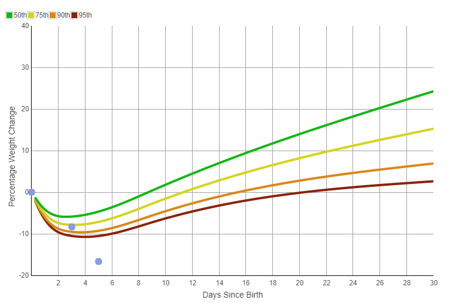

In the area beneath the mother's risk factors, there are two sections. The first of these sections contains a growth chart plotting the baby's weight losses and gains. This chart is based on the information provided by the [Newt](https://www.newbornweight.org/) graphs. It displays the 50th, 75th, 90th, and 95th percentiles for the physician to quickly see how the baby's weight compares to these norms.

##### 2.3.3 Lactation Referral and Questionnaire

The second area beneath the mother's risk factors is relating to whether a mother should be referred to a lactation consultant as well as gathering some basic information to share with the lactation consultant.

###### 2.3.3.1 Lactation Referral Recommendation

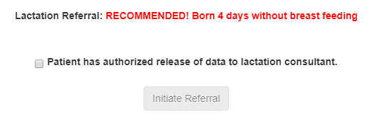

Based on the baby's weight and the information gathered in the iOS app, the system has been configured to make recommendations based on how the baby is doing and how breastfeeding is going. If the baby or the mother meet any of the criteria, the system will display a message recommending that the mother and baby be referred to a lactation consultant, otherwise a message is displayed saying the mother and baby can be referred if they'd like to be.

If the mother elects to be referred to a lactation consultant, they have the option of providing the physician with some basic information to share with the lactation consultant. Before gathering this information, the Physician needs to receive permission to share this information with the lactation consultant. Once consent is given, the physician can check the box next to "Patient has authorized release of data to lactation consultant."

###### 2.3.3.2 Lactation Questionnaire

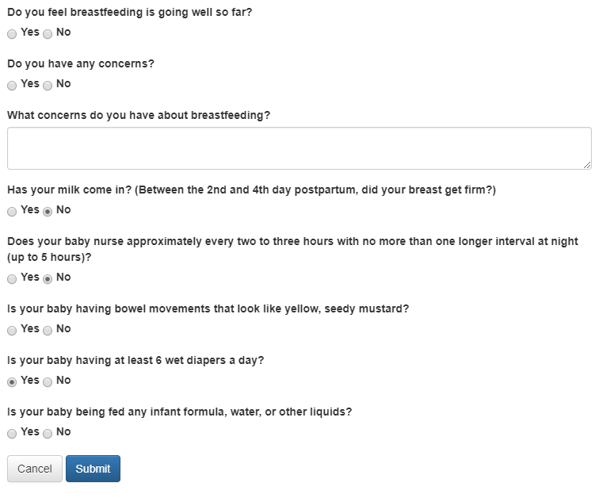

After the mother agrees to seeing a lactation consultant and grants permission to share some basic information with them, the physician can click the "Initiate Referral" button. Upon doing so, a questionnaire will appear. If the mother has been using the iOS app, some information may pre-populate based on their responses to the iOS app. If no information appears, the physician will need to ask the questions to the mother and fill in her responses.

Once the information is gathered, the physician can click the "Submit" button to complete the referral. This will then appear for the lactation consultant to view and contact the mother.

---

### 3. iOS Application
This section provides instructions on how to use the features associated with the iOS application.

#### 3.1 Installation
< **NOTE**: Installation hasn’t been implemented this semester; this feature was not within the project's scope for this semester (Fall 2017). Implementing this will require an Apple Developer account to make apps available for download and to create IPA files for distribution. >

1. On the iOS device, launch the “App Store”.
2. In the App Store, tap the “Search” tab.
3. Tap the search bar box and enter “Breastfeeding Support” and tap “Search”
4. Locate the app in the search result list and tap the “GET” button next to the app name.
5. Enter your Apple ID credentials if prompted.
6. Allow the installation process to complete.

---

#### 3.2 Application Usage

This section provides instructions on how to use the features associated with the iOS application.

#### &nbsp;

##### 3.2.1 Logging into Application (Not Implemented)
< **NOTE**: The login system hasn’t been implemented; this feature was not within the project's scope for this semester (Fall 2017). However, once the login system has been implemented, then these are the instructions that’ll be used. For now, you can log into the app by typing a mother patient's id that exists on the FHIR server in the username box and tap “Login”. >

1. With the app launched, enter your Breastfeeding Support Username and Password.

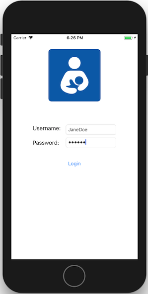

2. Tap “Login” to login to the app.

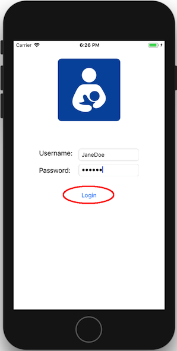

#### &nbsp;

##### 3.2.2 Answering Questionnaire
The questionnaire will only appear once a day.

1. When the questionnaire appears, answer the questions presented by selecting the choices associated with each question.
2. After answering all the questions, tap the “Submit” button to submit your answers.

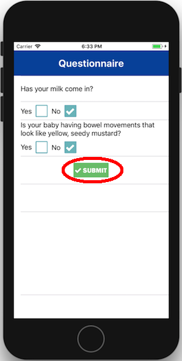

#### &nbsp;

##### 3.2.3 Recording Breastfeeding Session

1. While logged into the app, Tap the “Record” tab.
2. When ready, hit “START” to start the timer.
3. When finished, hit “STOP” to end the timer.
4. Using the plus (“+”) and minus (“-”) buttons, enter the number of wet diapers your infant had since the last breastfeeding session.
5. Tap the “RECORD” button to save the breastfeeding session data.

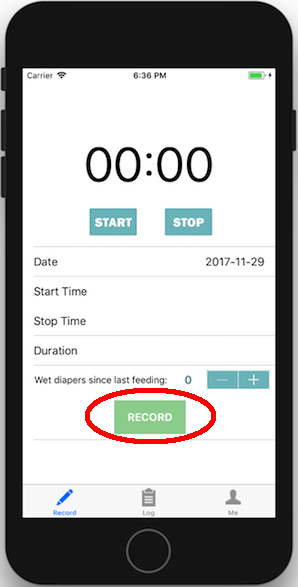

#### &nbsp;

##### 3.2.4 Viewing Breastfeeding Session Logs

1. While logged in, Tap the “Log” tab.
2. Refresh the table by touching the screen your finger and make a downward drag motion until a graphic of a spinning pinwheel appears.

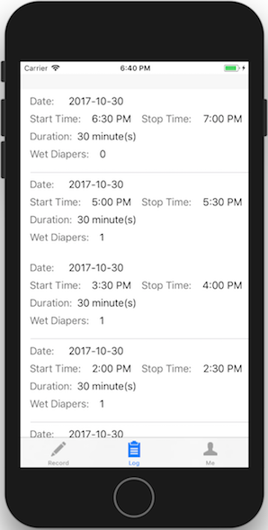

#### &nbsp;

##### 3.2.5 Viewing Your Account Profile (Not Implemented)
< **NOTE**: The Viewing Account Profile hasn’t been implemented; this feature was not within the project's scope for this semester (Fall 2017). However, once the login system has been implemented, then these are the instructions that’ll be used. >

1. While logged in, Tap the “Me” tab.
2. In the “Me” main menu, tap the “View My Profile” button.

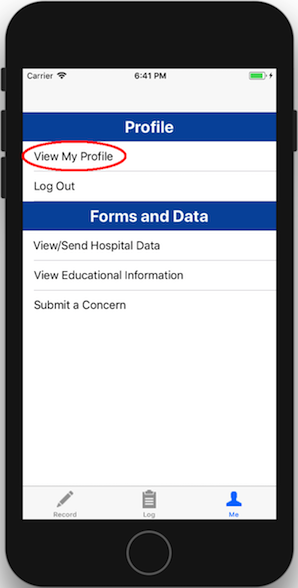

#### &nbsp;

##### 3.2.6 Viewing/Sending Hospital Data

1. While logged in, Tap the “Me” tab.
2. In the “Me” main menu, tap the “View/Send Hospital Data” button.

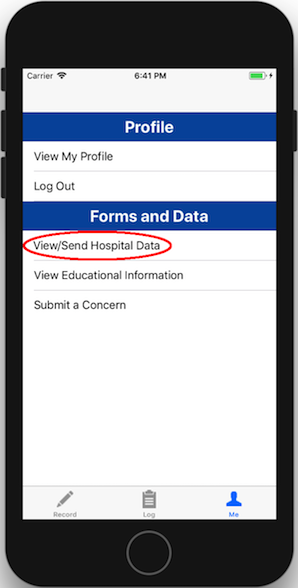

A window will appear that’ll contain hospital data.

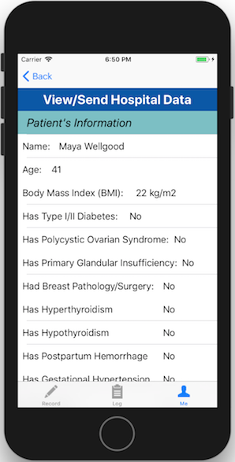

 To send this data to the care provider:

1. Scroll to the bottom of the table and tap the “Send Data to Pediatrician”.

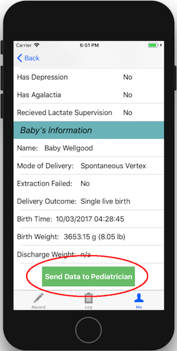

2. An alert will appear asking if you are sure you want to send your data, if you want to send the data, then tap “Submit”.

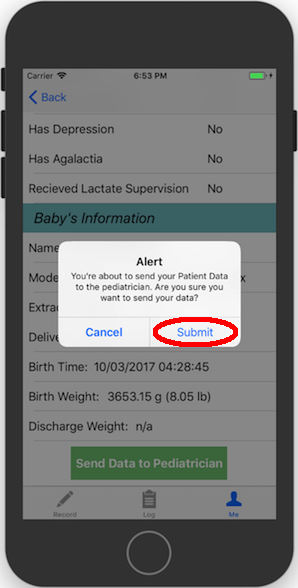

#### &nbsp;

##### 3.2.7 Viewing Educational Information (Not Implemented)
< **NOTE**: The Educational Information section hasn’t been implemented; this feature was not within the project's scope for this semester (Fall 2017). However, once the educational information section has been implemented, then these are the instructions that’ll be used. >

1. While logged in, Tap the “Me” tab.
2. In the “Me” main menu, tap the “View Educational Information” button.

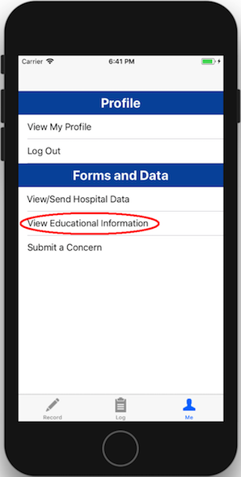

3. Search for and obtain any information on breastfeeding.

#### &nbsp;

##### 3.2.8 Submitting a Concern

1. While logged in, Tap the “Me” tab.
2. In the “Me” main menu, tap the “Submit a Concern” button.

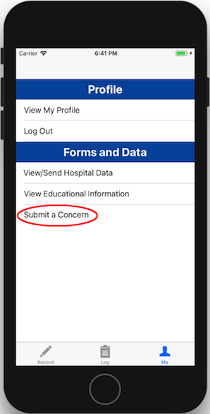

3. In the text box, type any questions or concerns you may have.
4. Tap the “Submit” button to send the concern.

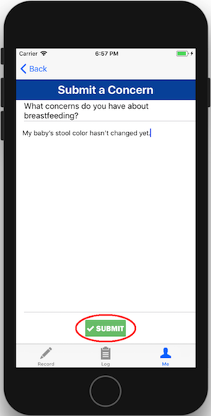

#### &nbsp;

##### 3.2.9 Logging Out

1. While logged in, Tap the “Me” tab.
2. In the “Me” main menu, tap the “Log Out” button.

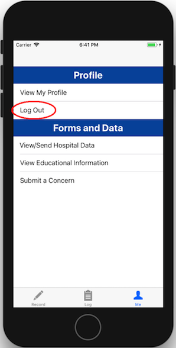

3. The application will return to the login screen.

---
