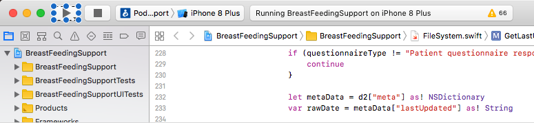

# **Breastfeeding Support System**

## **Special Instructions**

Version 1.1 - Dec 7, 2017

#### **Project**
CDC Breastfeeding Support Initiative

#### **Team We Didn't Start the FHIR**
Jamon Bowen, Phillip Baxley, Justin Kristensen, John Van Wagenen, Zeyu Yang

#### **GitHub Link**

https://github.com/CDCgov/GaTech-Fall2017-Wilmore-Breastfeeding-WeDidntStartTheFHIR

---

### 1. Introduction
The CDC Breastfeeding support initiative has both a consumer and practitioner focus with the goal to improve the success of new mothers breastfeeding efforts.   

#### 1.1 Purpose
The purpose of this document is to provide instructions on how to setup and run a working breastfeeding support system environment.

#### 1.2 Document Breakdown
The system has three parts: a FHIR server, a care provider web portal, and an iOS application. The FHIR server will need to be up first before running the web portal and the iOS application. The section 2 will give instructions on how to startup the FHIR server, Section 3 will give instructions on how to startup the Care Provider Web Portal, and Section 4 will give instructions on how to startup the iOS application.  To run both the iOS app and the other parts of the application, a Mac test platform running the Yosemite release of OSX is required.  A complete walkthrough of the start-up procedure is available here: *https://youtu.be/tIViSa6zZxg*

---
### 2. FHIR Server Startup Instructions

**Prerequisites**: 
- Docker is installed on the test platform.  
- Internet access is available to get the source HAPI Fhir docker image.
- The git repo has been cloned locally.

#### Start The Container
- In the `Final Delivery` directory type the command `docker-compose up`
- Wait 2 minutes (during this time the Fhir server, the Care Provider Portal, and jetty launch.)
- The source data for 5 patients will then populate into the FHIR server using POST commands, this will happen automatically and will results in many messages being printed on the console of the container.
- Navigate to http://127.0.0.1:8080/ and the FHIR server and test data will be visible for raw inspection.

### 3. Care Provider Web Portal Startup Instructions
**Prerequisite**: FHIR Server started and running.

#### Navigate to the portal
- Navigate to http://127.0.0.1:8080/portal Care Provider Portal.  This pulls data from the FHIR server.
- In many cases when interacting other tools that are added data to the FHIR server you will need to refresh to http://127.0.0.1:8080/portal to pickup the changes.  As this is expected to be used in a clinical session from an EHR with frequent relaunches this is expected behavior.

### 4. iOS Application Startup Instructions
**Prerequisite**: FHIR Server started and running.  Test platform is a Mac running OSX Yosemite 

#### Launch the iOS app in a simulator
- Open Xcode (launchpad -> Xcode)
- Open the iOS app project workspace (File->Open, Navigate the the git root->ios-app-> BreastFeedingSupport.xcworkspace) 
- Click on the "Play" button to build the program and run on the default simulator. 
- Login to the app from the simulator using the Patient ID of one of the patients (available in the Care Provider Portal by clicking on a patent and see the final number in the resulting URL) 
- The app is fully functional and will submit data to the EHR if the business logic rules are met (concerns a sent immediately, breastfeeding metrics are only sent once per day)

### 5. Using the Applications
For detailed information on how to use the applications. Please see the following manuals in the Final Delivery folder:

- *Care Provider Web Portal*: Manual – We Didn't Start The FHIR - Web Portal(.md/.pdf)
- *iOS Application*: Manual:
- *Testcases*: These can be used without the iOS app, description and status: 
