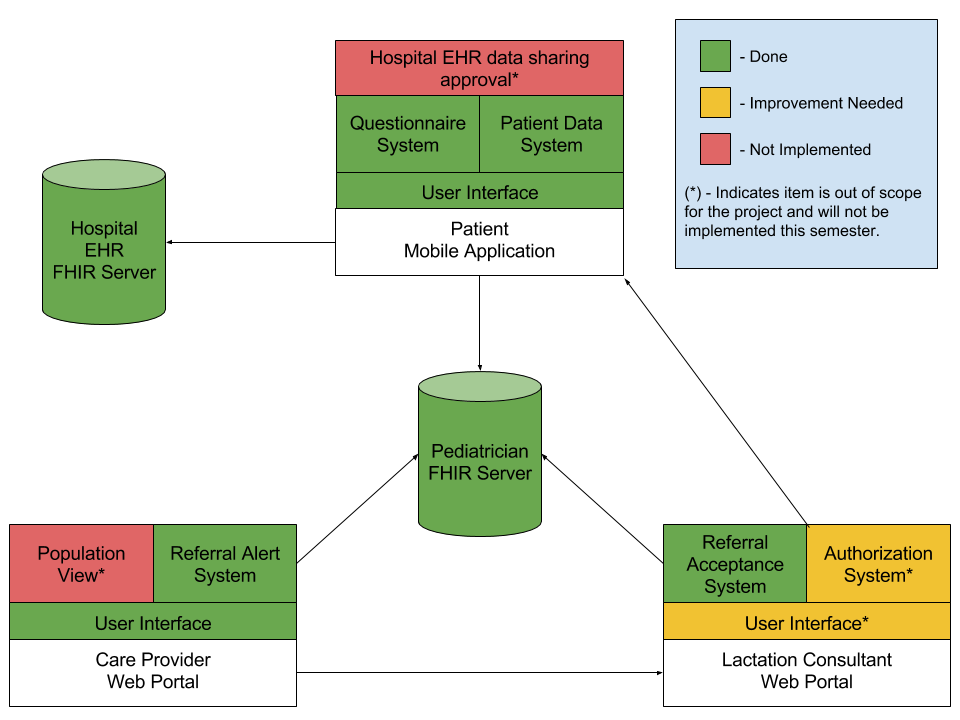

# Architectural Diagram

There are three main components to the application: the iOS app, the physician portal, and the lactation consultant portal.  Additionally, the data from the hospital EHR is bridged into the application environment using the iOS app.

There are a number of ways that data is interchanged in the full solution.  This document will describe the data that is transmitted at a high level, and full details are available via sample json data  

The  for the full application can also be consulted here to get a general idea of the usage of different parts of the solution

## Mothers and baby’s data from the hospital EHR.

The Hospital EHR containers two sets of data - the mother's health history and the new babies start of life time and various weight metrics. 

Specifically the following data is collected
- Baby’s birth time – patient, \_birthDate, extension, valueDateTime (in the babies patent record)
- Baby’s birth weight – observation, vital-signs, Birth weight Measured (associated with baby)
- Baby’s discharge weight - observation, vital-signs, Body weight Measured (associated with baby) _This is not really the discharge weight, but the format for all clinically recorded weights_

Mother’s risk factors
- Age - patient
- Maternal obesity – BMI (https://hl7.org/fhir/2017Jan/observation-example-bmi.html) – observation, vital-signs, BMI (associated with mother)
- Type I/II diabetes – Claim, diagnosis, diagnosisCodeableConcept (associated with mother)
- Polycystic ovarian syndrome - Claim, diagnosis, diagnosisCodeableConcept (associated with mother)
- Hyperthyroidism - Claim, diagnosis, diagnosisCodeableConcept (associated with mother)
- Hypothyroidism - Claim, diagnosis, diagnosisCodeableConcept (associated with mother)
- Mode of delivery – Claim, procedure, procedureCodeableConcept (associated with mother)
- Primary glandular insufficiency
- Breast pathology/surgery

As we need data from both the baby and the mother there is also a RelatedPerson FHIR resource that ties the baby and mother together. 

As the mother needs to expressly authorize the release of this data the iOS app is used as the conduit to collect this data an authorize its transition to the pediatrician’s EHR.

_NOTE: AS of Fall 2017, the connection and release of data from a hospital EHR is not implemented.  The data is created in a single FHIR server; however, the iOS app is structured to expect connecting to two separate FHIR systems in the future.  It is anticipated that a new view will be needed in the iOS app to implement the initial authentication to connect to both FHIR servers and perform the initial transfer of data.  The project as it is currently implemented is after this step has taken place._

## iOS App Daily Statistics

There is data that are needed for the clinical decision support of a lactation referral that the iOS app is responsible for submitting.  These are collect for up to 30 days in the following two questionaire response FHIR resources:

Daily Breastfeeding statistics:
- Date of survey data
- Daily Breastfeeding metrics (average length, number of feedings, median interval, maximum gap)
- Daily wet diaper counts

Mother's Status:
- Date of survey data
- If the Mother's Milk has come in
- If bowel movements have transitioned from Meconium to normal breastfeed baby bowel movements.
_Note that the mother is only asked these question until they become yes in the iOS app_ 

It is also reported if the following has been submitted:
- If mother signaled a concern 

This data is sent as a questionaire response to the FHIR server even though the data for the questionaire response is automatically gathered by the iOS daily. 

The clinical logic on when a referral is warranted is documented   This data is collected in the iOS app and the points of collection can be inferred from the iOS app wireframes 

## Pediatrician Portal

The Pediatrician portal is used to observe the new babies weight gain/loss vs. expectations as well as the data provided by the app on how breast feeding is going.  This data is used to evaluate against the clinical logic to determine that breastfeeding is going poorly and suggest referral to a lactation consultant.

This SMART app uses the Weight data transmitted from the hospital EHR, local weight measurements done by the Pediatrican, and the survey response data collected from the iOS App.

## Lactation Consultant 
The lactation consultant portal accepts or rejects lactation consultation referrals.  It is anticipated that future versions of this tool will enable some patient data to be transmitted to the lactation consultants as well as a mechanism for the lactation consultant to provide feedback to the pediatrician.  The existing tool has not been changed in the alpha release.
